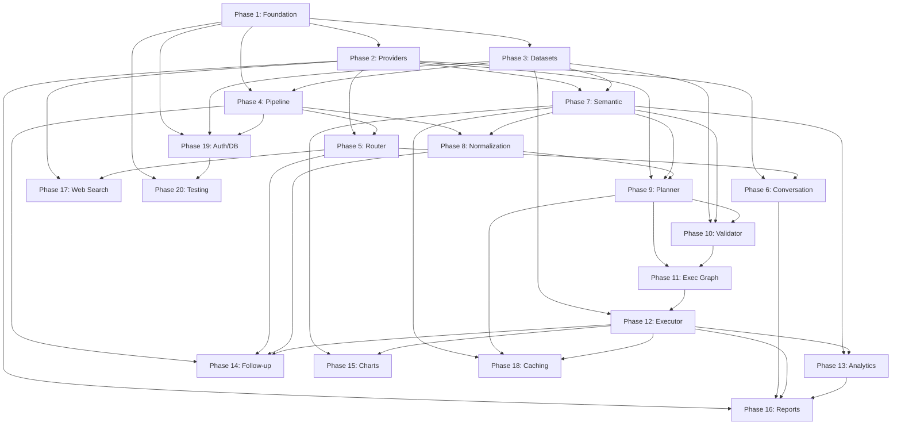

# Plexis V2 — Complete Backend Development Roadmap

> Designed by: Chief Software Architect
> Date: July 2026
> Scope: ~20 phases, backend-only rebuild
> Frontend: Frozen (React/Vite, already deployed)
> Constraint: Every phase must leave the system in a working, testable state

---

## Architectural Premise

Before reading the phases, understand the governing principle:

```
User Request
  → Request Pipeline (deterministic, logged, traceable)
    → Master Router (multi-signal intent dispatch)
      → Selected Engine (specialized, not general-purpose)
        → Semantic Layer (dataset understanding, not raw columns)
          → Planner (structured execution plan, never direct LLM answers)
            → Validator (confidence scoring, repair)
              → Execution Graph (dependency-resolved, optimized)
                → Executor (Python calculates, deterministically)
                  → Report Engine (LLM explains, professionally)
                    → Frontend Response
```

**LLMs reason. Python calculates. LLMs explain. Never the opposite.**

Every phase below is designed so the system is functional at the end of that phase. No phase creates dead code waiting for a future phase to activate it. Every phase is independently deployable and testable.

---

---

## Phase 1 — Backend Foundation

**Title:** Core Application Skeleton

**Objective:** Establish the absolute minimum infrastructure required for the Flask backend to start, accept requests, return responses, load configuration, and produce structured logs. After this phase, the frontend can connect to the backend and receive valid JSON responses — even if those responses are simple placeholders.

**Why It Exists:** Every other phase depends on having a running server, a configuration system, an error handling strategy, and a response format that matches the frontend contract. Building this first eliminates the most common source of early-project chaos: inconsistent configuration, unstructured errors, and format mismatches. The frontend's [responseHelpers.js](file:///c:/Users/user/Downloads/Plexiss-main/Plexiss-main/src/utils/responseHelpers.js) expects a specific JSON shape — this phase locks that contract in place permanently.

**Components Introduced:**

- Flask application factory with Blueprint registration
- CORS configuration (allowing Vite dev server at `localhost:5173`)
- Environment-based configuration system (`.env` + `config.py`)
- Standardized response builder matching the frontend contract (`answer`, `source`, `provider`, `dataset_info`, `chart_data`)
- Standardized error response builder with HTTP status codes
- Structured logging system (JSON-formatted, request-scoped)
- Request ID generation middleware (every request gets a UUID)
- Health check endpoint (`GET /api/health`)
- Stub endpoints: `POST /api/upload`, `POST /api/ask` (returning valid placeholder responses)
- Internal event bus foundation (simple synchronous pub/sub for now)

**Folder Structure:**

```
backend/
├── run.py
├── app.py
├── config.py
├── requirements.txt
├── .env.example
├── api/
│   ├── __init__.py
│   ├── health.py
│   ├── datasets.py          (stub)
│   └── chat.py              (stub)
├── core/
│   ├── __init__.py
│   ├── errors.py
│   ├── middleware.py
│   └── events.py
├── utils/
│   ├── __init__.py
│   └── response.py
└── logging/
    ├── __init__.py
    └── logger.py
```

**Dependencies:** None (this is the root of the dependency tree)

**Testing Strategy:**
- Start the server, verify `GET /api/health` returns `200`
- Send `POST /api/upload` with a dummy file, verify the response matches the frontend contract shape
- Send `POST /api/ask` with a test message, verify the response matches the frontend contract shape
- Verify structured logs are produced for every request
- Verify every request has a unique Request ID in logs and response headers
- Verify CORS headers allow `localhost:5173`
- Verify `.env` values override defaults in `config.py`

**Completion Criteria:**
- Frontend can connect to backend without CORS errors
- Both endpoints return valid JSON that passes through `extractResponseText()` and `extractMetadata()` without crashing
- Structured JSON logs are written for every request
- Configuration is loaded from environment variables
- Error responses are standardized and include request IDs

**Risk Level:** Low

**Estimated Complexity:** Small (1–2 days)

**What Becomes Possible:** Every subsequent phase has a running server to build on. The response contract is locked. Logging is available everywhere. Configuration is centralized.

---

---

## Phase 2 — Provider Intelligence System

**Title:** LLM Provider Abstraction & Model Registry

**Objective:** Build the complete provider engine that abstracts away Gemini, OpenRouter, and future providers behind a unified interface. After this phase, any component in the system can request LLM generation without knowing which provider, model, or API is behind it. The system selects the best available model automatically.

**Why It Exists:** Nearly every intelligent component in Plexis needs LLM access — the router, the planner, the conversation engine, the report writer, the semantic layer. If we build any of those first, we'd be hardcoding provider calls that would need to be ripped out later. By building the provider system second, every subsequent phase gets provider-independent LLM access from day one.

The previous backend likely called Gemini or OpenRouter directly in various places. This phase ensures that never happens again. A new provider should be addable by implementing a single interface and registering it.

**Components Introduced:**

- Abstract provider interface (`BaseProvider` with `generate()`, `generate_json()`, `health_check()`)
- Gemini provider implementation
- OpenRouter provider implementation
- Model Registry — every model registered with structured metadata:
  - Name, provider, max context window, max output tokens
  - Supports: vision, JSON mode, tool calling, streaming, reasoning
  - Task affinities: planner, chat, report writing, classification
  - Average latency, estimated cost per 1K tokens, priority
  - Health score, reliability score
- Provider Registry — manages provider instances, API keys, availability
- Health Monitor — periodic health checks, marks providers as degraded/offline
- Latency Tracker — rolling average per model
- Intelligent Model Selector — given a task type + requirements, selects the best available model
- Fallback Engine — if primary provider fails, automatically tries next best
- Retry Engine — configurable retry with exponential backoff
- Circuit Breaker — after N consecutive failures, temporarily stops calling a provider
- Timeout system — per-provider, per-model configurable timeouts
- Provider events emitted to event bus: `provider_called`, `provider_failed`, `provider_switched`

**Folder Structure:**

```
backend/
├── providers/
│   ├── __init__.py
│   ├── base.py
│   ├── registry.py
│   ├── model_registry.py
│   ├── selector.py
│   ├── health.py
│   ├── fallback.py
│   ├── retry.py
│   ├── circuit_breaker.py
│   ├── gemini.py
│   └── openrouter.py
```

**Dependencies:** Phase 1 (config, logging, events)

**Testing Strategy:**
- Unit test each provider with mocked HTTP responses
- Test model registry CRUD and metadata queries
- Test selector logic: given task type "planner" with JSON mode required, verify correct model is chosen
- Test fallback: mock primary provider failure, verify secondary is called
- Test circuit breaker: after 5 failures, verify provider is marked offline and requests go to fallback
- Test retry: mock transient failure, verify retry succeeds on second attempt
- Test health monitor: mock mixed health responses, verify scores update correctly
- Integration test: make a real API call to at least one provider (gated behind env flag)

**Completion Criteria:**
- `ProviderEngine.generate(task="chat", prompt="Hello")` works end-to-end
- Provider selection is automatic based on task type and model capabilities
- Fallback works when primary provider is unavailable
- Health scores are tracked and influence selection
- Adding a hypothetical "OpenAI" provider would require only: one new file, one registry entry

**Risk Level:** Medium (API key configuration, rate limits, provider-specific quirks)

**Estimated Complexity:** Medium (3–4 days)

**What Becomes Possible:** Every subsequent phase that needs LLM intelligence has a clean, resilient, provider-independent interface. No component will ever import `gemini` or `openrouter` directly.

---

---

## Phase 3 — Dataset Lifecycle

**Title:** Upload, Storage, Registry, Fingerprinting, and Profiling

**Objective:** Build the complete dataset management system. After this phase, users can upload CSV/Excel files through the frontend, and the backend will store them, fingerprint them, profile them, and return `dataset_info` metadata that populates the Analytics panel. The `POST /api/upload` endpoint becomes fully functional.

**Why It Exists:** The dataset is the foundation of everything analytical in Plexis. Before we can route, plan, or execute — we need to know what data exists, what its schema looks like, what types of columns it has, and how to load it efficiently. Every analytical phase depends on this.

**Components Introduced:**

- Dataset Storage — save uploaded files to disk (configurable path), handle naming collisions
- Dataset Registry — in-memory registry of all loaded datasets, keyed by filename/ID
  - Tracks: filename, upload timestamp, row count, column count, schema hash, fingerprint
- Dataset Loader — load CSV/Excel into pandas DataFrames with intelligent type inference
  - Handle: UTF-8/encoding detection, missing values, duplicate columns, mixed dtypes
  - Support: `.csv`, `.xlsx`, `.xls` (multi-sheet: load first sheet by default)
  - Large file handling: chunked loading for files > 50MB
- Dataset Fingerprinting — SHA-256 hash of file contents for change detection
- Schema Fingerprinting — hash of column names + dtypes for schema versioning
- Dataset Profiler — generates the `dataset_info` object the frontend expects:
  - `rows`, `columns`, `memory_usage`, `column_types`
- Schema Profiler — detailed schema analysis:
  - Column name, dtype, null count, null percentage, unique count, sample values
- Column Profiler — per-column statistics:
  - For numeric: min, max, mean, median, std, quartiles
  - For categorical: top values, frequency distribution, cardinality
  - For datetime: min date, max date, range, granularity
- Wire up `POST /api/upload` to use all of the above
- Dataset events: `dataset_uploaded`, `dataset_loaded`, `dataset_profiled`

**Folder Structure:**

```
backend/
├── datasets/
│   ├── __init__.py
│   ├── storage.py
│   ├── registry.py
│   ├── loader.py
│   ├── fingerprint.py
│   ├── profiler.py
│   ├── schema_profiler.py
│   └── column_profiler.py
├── storage/
│   └── uploads/            (gitignored, runtime directory)
```

**Dependencies:** Phase 1 (API layer, response builder, logging, config)

**Testing Strategy:**
- Upload a CSV via `POST /api/upload`, verify file is saved and registered
- Verify `dataset_info` in response matches actual DataFrame properties
- Upload the same file twice, verify fingerprint detects no change
- Modify a file and re-upload, verify fingerprint detects change
- Upload an Excel file, verify first sheet is loaded correctly
- Upload a file with missing values, verify null statistics in profiler output
- Upload a file with mixed dtypes, verify type inference is reasonable
- Upload a large file (100K+ rows), verify it loads within acceptable time
- Upload malformed data (empty file, non-CSV), verify clean error responses

**Completion Criteria:**
- `POST /api/upload` with a real CSV returns valid `dataset_info` that the Analytics panel can display
- Datasets are persisted to disk and survive server restarts
- Dataset registry tracks all uploaded datasets
- Profiler output is accurate for numeric, categorical, and datetime columns
- Frontend Analytics panel shows: rows, columns, memory usage, column types

**Risk Level:** Low–Medium (edge cases in file parsing, encoding issues)

**Estimated Complexity:** Medium (3–4 days)

**What Becomes Possible:** The Analytics panel is populated. The upload flow works end-to-end. Every future analytical component has access to loaded DataFrames, schema information, and column profiles.

---

---

## Phase 4 — Request Pipeline & Session Management

**Title:** Deterministic Request Processing Pipeline

**Objective:** Build the mandatory processing pipeline that every request flows through before reaching any engine. After this phase, every `POST /api/ask` request is assigned to a session, the dataset is verified, conversation memory is initialized, and the request is enriched with context — all before any routing or intelligence happens.

**Why It Exists:** The Plexis Constitution mandates that every request must flow through a deterministic intelligence pipeline. Without this, requests would arrive at the router with no context about who's asking, what dataset they're working with, or what they asked before. This phase establishes the pipeline that every subsequent phase plugs into.

**Components Introduced:**

- Request Pipeline — ordered chain of processing stages, each independently testable:
  1. Request ID Generation (already exists from Phase 1, now formalized)
  2. Session Identification (extract or create session from request)
  3. Dataset Verification (confirm the referenced dataset exists and is loaded)
  4. Dataset Fingerprint Validation (confirm schema hasn't changed since last interaction)
- Session Manager — create, retrieve, update sessions
  - Session contains: session ID, user ID (future), active dataset ID, created_at, last_active
  - In-memory for now (designed for PostgreSQL migration later)
- Conversation Memory — stores message history per session
  - Append messages, retrieve recent N messages, clear
  - In-memory with configurable max depth (default: 50 messages)
- Execution Context object — a structured bag passed through the entire pipeline:
  - `request_id`, `session_id`, `dataset_id`, `dataset_fingerprint`
  - `schema_hash`, `message`, `conversation_history`
  - `timestamps` (pipeline stage entry/exit times)
  - `confidence_scores` (populated by downstream stages)
  - `trace` (list of stage names + durations for observability)
- Pipeline events: `pipeline_started`, `pipeline_stage_completed`, `pipeline_finished`

**Folder Structure:**

```
backend/
├── core/
│   ├── pipeline.py
│   └── context.py
├── session/
│   ├── __init__.py
│   └── manager.py
├── memory/
│   ├── __init__.py
│   └── conversation.py
```

**Dependencies:** Phase 1 (middleware, logging), Phase 3 (dataset registry, fingerprint)

**Testing Strategy:**
- Send a request with no session info, verify a new session is created
- Send two requests with the same session, verify conversation history accumulates
- Reference a non-existent dataset, verify clean error response
- Reference a valid dataset, verify the execution context is enriched with schema info
- Verify pipeline trace records timing for each stage
- Verify conversation memory respects max depth (message 51 evicts message 1)
- Send 100 requests across 10 sessions, verify session isolation

**Completion Criteria:**
- Every `/api/ask` request flows through the pipeline before reaching any logic
- Sessions are created, tracked, and reusable
- Conversation history is stored per session
- Execution context carries all metadata downstream stages need
- Pipeline trace is logged for every request

**Risk Level:** Low

**Estimated Complexity:** Medium (2–3 days)

**What Becomes Possible:** The router (Phase 5) receives enriched, contextualized requests instead of raw strings. Memory is available for follow-up understanding. Sessions enable multi-turn conversations.

---

---

## Phase 5 — Master Router & Engine Architecture

**Title:** Intelligent Request Dispatch

**Objective:** Build the Master Router that classifies every request and dispatches it to the correct specialized engine. After this phase, the system can distinguish between "Hello, how are you?", "What is the average salary?", and "Search latest NVIDIA stock" — and route each to the appropriate handler. Establish the engine interface that all specialized engines will implement.

**Why It Exists:** A single monolithic handler cannot scale to the complexity Plexis requires. The router is the traffic controller. Without it, every request would go through the same code path regardless of whether it's casual chat or complex analytics. The router also enables the plugin architecture — future engines register themselves with the router without modifying core code.

**Components Introduced:**

- Master Router — multi-signal intent classification:
  - Signals used: message content, conversation history, dataset availability, session state
  - Classification strategy: keyword heuristics first (fast path), LLM classification for ambiguous cases
  - Supported intents (initially):
    - `conversation` — greetings, general chat, help, programming questions
    - `analysis` — data questions requiring the planner pipeline
    - `title_generation` — conversation title requests (detected by specific prompt patterns)
    - `web_search` — external information requests (stub engine for now)
    - `help_system` — questions about Plexis itself
  - Confidence scoring on classification decisions
  - Routing decisions logged to structured logs
- Engine Interface — abstract base class all engines implement:
  - `can_handle(context: ExecutionContext) → bool`
  - `handle(context: ExecutionContext) → EngineResult`
  - `engine_name` property
- Stub Conversation Engine — handles `conversation` and `title_generation` intents
  - Uses provider engine to generate LLM responses for general chat
  - Returns responses in the frontend-compatible format
- Stub Analysis Engine — handles `analysis` intent
  - For now: uses LLM to generate a direct response about the dataset (temporary until Planner exists)
  - Includes dataset schema in the prompt so responses are contextually relevant
- Engine Registry — engines register themselves, router queries registry for dispatch
- Router events: `intent_classified`, `engine_selected`, `engine_completed`

**Folder Structure:**

```
backend/
├── router/
│   ├── __init__.py
│   ├── master_router.py
│   ├── intent_classifier.py
│   └── engine_registry.py
├── engines/
│   ├── __init__.py
│   ├── base.py
│   ├── conversation.py
│   └── analysis.py          (stub — will be replaced in Phase 8+)
```

**Dependencies:** Phase 1 (response builder), Phase 2 (provider engine), Phase 4 (pipeline, context, memory)

**Testing Strategy:**
- "Hello" → routes to `conversation` engine
- "What is the average salary?" (with dataset loaded) → routes to `analysis` engine
- "What is the average salary?" (no dataset loaded) → routes to `conversation` with guidance to upload a dataset
- "Generate a concise conversation title..." → routes to `title_generation`
- "Search latest NVIDIA stock" → routes to `web_search` (stub returns graceful message)
- Ambiguous messages tested with confidence scores logged
- Verify engine registry correctly resolves intents to engines
- Verify router logs every classification decision

**Completion Criteria:**
- `/api/ask` routes messages to the correct engine based on intent
- General chat works end-to-end (user sends "Hello", gets a friendly response)
- Dataset questions get contextual LLM responses (temporary, pre-planner)
- Conversation title generation works (frontend auto-titles function correctly)
- The frontend is fully functional for basic chat + file upload + title generation

**Risk Level:** Medium (intent classification accuracy)

**Estimated Complexity:** Medium (3–4 days)

**What Becomes Possible:** The frontend is now genuinely usable. Users can chat, upload datasets, get basic responses, and auto-generated titles work. Every future engine plugs into this router without modifying existing code. This is the first "demo-able" milestone.

---

---

## Phase 6 — Conversation Engine & Personality System

**Title:** Human-Quality Conversational Intelligence

**Objective:** Replace the stub conversation engine with a full-featured conversational system that makes Plexis feel like talking to an intelligent colleague, not a chatbot. After this phase, general conversation feels premium — warm, natural, professional, and personality-aware.

**Why It Exists:** First impressions matter. If the first thing a user types is "Hello" and they get a robotic response, trust is lost before they ever upload a dataset. The conversation engine handles every non-analytical interaction, and it's the personality layer that users will judge the product by. This also establishes the prompt management system that every engine will use.

**Components Introduced:**

- Full Conversation Engine — replaces the Phase 5 stub:
  - Conversation-aware: includes recent history in prompts
  - System prompt defines Plexis identity, behavior, and boundaries
  - Handles: greetings, general knowledge, programming help, reasoning, casual discussion
  - Knows when to suggest uploading a dataset vs. answering generally
- Personality Engine — defines tone, vocabulary, and response style:
  - Personalities (selected automatically based on context):
    - **General Assistant** — warm, friendly, natural
    - **Data Analyst** — professional, precise, confident (activated when datasets are loaded)
    - **Programming Assistant** — technical, code-formatted
    - **Teaching Assistant** — patient, step-by-step
  - Each personality defines: tone, emoji policy, formatting style, response length, confidence expression
- Prompt Manager — centralized prompt template system:
  - Templates stored as structured Python strings (not files, for now)
  - Variable interpolation: `{user_message}`, `{conversation_history}`, `{dataset_schema}`
  - Prompt versioning: every template has a version number for traceability
- Title Generation — dedicated handler for conversation title requests:
  - Optimized prompt: short, concise, uses smallest/cheapest model
  - Fallback: if LLM fails, truncate first message to 5 words

**Folder Structure:**

```
backend/
├── engines/
│   └── conversation.py      (rewritten, full implementation)
├── personality/
│   ├── __init__.py
│   ├── engine.py
│   └── profiles.py
├── prompts/
│   ├── __init__.py
│   ├── manager.py
│   └── templates.py
```

**Dependencies:** Phase 2 (provider engine), Phase 4 (memory, context), Phase 5 (router, engine interface)

**Testing Strategy:**
- "Hello" → returns warm, natural greeting (not robotic)
- "Explain recursion" → returns programming-style response with code formatting
- "What can you do?" → returns Plexis capabilities description
- Multi-turn conversation test: 5 messages, verify context is maintained
- Personality detection: with no dataset loaded → General Assistant tone; with dataset → Data Analyst tone
- Title generation: 20 diverse messages → verify all titles are ≤5 words, sensible
- Stress test: 50 concurrent conversation requests, verify no cross-session contamination
- Prompt versioning: verify template version is logged with every LLM call

**Completion Criteria:**
- General conversation feels natural and intelligent
- Personality adapts to context (casual vs. analytical)
- Multi-turn conversation works with memory
- Title generation is fast and reliable
- Prompt templates are centralized and versioned
- Users would not be able to distinguish Plexis general chat from a premium AI assistant

**Risk Level:** Low (primarily prompt engineering)

**Estimated Complexity:** Medium (2–3 days)

**What Becomes Possible:** Plexis feels premium from the first interaction. The prompt management system is available for every future engine. The personality system ensures analytical responses will sound like a senior analyst, not a chatbot.

---

---

## Phase 7 — Semantic Knowledge Layer

**Title:** Dataset Intelligence & Ontology

**Objective:** Build the semantic layer that transforms raw DataFrame columns into classified concepts. After this phase, Plexis doesn't see "column A has dtype float64" — it sees "Profit is a Metric, Region is a Dimension, Student_ID is an Identifier, Date is a Time column, and Overall Score could be derived from Math + Science + English."

**Why It Exists:** This is the single most important architectural improvement over the original backend. Without it, every component (planner, executor, chart engine, report writer) would independently try to figure out what "Profit" means, what "Student_ID" is, whether "Region" is filterable, and whether "Overall Score" already exists or needs calculation. The semantic layer solves this once, and every downstream component consumes structured knowledge instead of guessing.

**Components Introduced:**

- Ontology Builder — analyzes a profiled dataset and constructs a semantic ontology:
  - Uses column profiles (from Phase 3) + LLM reasoning to classify columns
  - Output: structured ontology object describing the dataset's meaning
- Column Classification — every column gets a semantic role:
  - **Metric** — numeric values that can be aggregated (Revenue, Score, Profit)
  - **Dimension** — categorical values used for grouping/filtering (Region, Department, Gender)
  - **Identifier** — unique keys, not analytically meaningful (Student_ID, Order_ID, UUID)
  - **Time** — temporal columns (Date, Year, Month, Quarter)
  - **Attribute** — descriptive properties, not metrics (Age, Name, Section)
- Concept Mapping — maps columns to universal analytical concepts:
  - "Revenue", "Sales", "Income" → concept: `revenue_metric`
  - "Region", "State", "Territory" → concept: `geographic_dimension`
  - This enables the system to understand datasets it has never seen before
- Domain Detection — infers the domain of the dataset:
  - Education, Finance, Retail, Healthcare, HR, Generic
  - No hardcoded rules — uses column names, value distributions, and LLM reasoning
  - Domain influences: default KPIs, report language, chart preferences
- Derived Metric Discovery — identifies metrics that could be calculated but don't exist:
  - If columns "Revenue" and "Cost" exist → suggest "Profit = Revenue - Cost"
  - If columns "Math", "Science", "English" exist → suggest "Overall Score = mean(Math, Science, English)"
  - If column "Revenue" exists with a Time dimension → suggest "Growth Rate"
- Relationship Discovery — basic column relationship detection:
  - Which dimensions are meaningful for which metrics
  - Which columns have high correlation
- Semantic Cache — ontology is built once per dataset fingerprint, cached for reuse

**Folder Structure:**

```
backend/
├── semantic/
│   ├── __init__.py
│   ├── ontology.py
│   ├── classifier.py
│   ├── concepts.py
│   ├── domain.py
│   ├── derived.py
│   └── relationships.py
```

**Dependencies:** Phase 2 (provider engine for LLM-assisted classification), Phase 3 (dataset profiler, column profiler, schema profiler)

**Testing Strategy:**
- Load a sales dataset → verify "Revenue" classified as Metric, "Region" as Dimension, "Order_ID" as Identifier
- Load a student dataset → verify "Math" as Metric, "Class" as Dimension, "Student_ID" as Identifier
- Load an HR dataset → verify domain detected as "HR"
- Verify derived metric discovery: dataset with "Revenue" + "Cost" → suggests "Profit Margin"
- Verify ontology is cached: second request for same dataset fingerprint → no LLM call
- Load a completely unknown dataset → verify classification still produces reasonable results
- Verify no hardcoded dataset-specific rules exist (run same test suite across 5 different datasets)

**Completion Criteria:**
- Every column in every uploaded dataset gets a semantic classification
- Domain is detected automatically
- Derived metrics are discovered when logically derivable
- Ontology is cached per dataset fingerprint
- Classification is accurate on at least 5 diverse test datasets
- Zero dataset-specific hardcoding

**Risk Level:** Medium–High (classification accuracy depends on LLM quality and prompt design)

**Estimated Complexity:** Large (4–5 days)

**What Becomes Possible:** The planner can reference "the primary metric" instead of guessing. The chart engine knows which columns are plottable. The report writer knows what KPIs to surface. Every downstream component is dramatically more intelligent.

---

---

## Phase 8 — Query Normalization & Reference Resolution

**Title:** Universal Query Understanding

**Objective:** Build the subsystem that transforms raw user messages into normalized, unambiguous analytical queries. After this phase, "show me the top 3" and "what are the 3 highest" produce identical internal representations. Follow-up messages like "what about the second one?" are rewritten into fully qualified queries.

**Why It Exists:** Natural language is wildly inconsistent. Users say "highest", "maximum", "top", "best", "largest" to mean the same thing. They say "that one", "the second", "compare both" expecting the system to resolve references from context. If the planner receives raw, unprocessed text, it must handle all this variation itself — which makes it fragile, slow, and unreliable. This phase normalizes the chaos before it reaches the planner.

**Components Introduced:**

- Universal Query Normalizer — rewrites queries into canonical analytical language:
  - "highest" / "maximum" / "top" / "best" / "largest" → `MAX`
  - "lowest" / "minimum" / "worst" / "smallest" / "least" → `MIN`
  - "average" / "mean" → `AVG`
  - "count" / "how many" / "number of" → `COUNT`
  - "top 5" / "best 5" / "highest 5" → `TOP_N(5)`
  - "second highest" / "runner up" / "2nd best" → `NTH_RANK(2, DESC)`
  - "compare X vs Y" / "X against Y" / "X versus Y" → `COMPARE`
  - "trend" / "over time" / "growth" → `TIME_SERIES`
  - "distribution" / "spread" / "breakdown" → `DISTRIBUTION`
  - Uses both heuristic rules and LLM for complex cases
- Intent Classifier — determines the analytical operation type:
  - `aggregate`, `filter`, `rank`, `compare`, `trend`, `distribution`, `correlation`, `describe`, `derive`
  - Confidence scored
- Reference Resolver — resolves references using conversation memory:
  - Pronoun resolution: "it" / "that" / "those" → referenced entity from previous messages
  - Ordinal resolution: "the second one" → second item from previous result
  - Implicit resolution: "what about the lowest?" → "what is the lowest [same metric as last query]?"
  - Comparative resolution: "compare both" → compare the two entities from recent context
- Alias Resolver — maps informal column references to actual column names:
  - "profit" might map to column "Net_Profit" or "Profit_Margin"
  - Uses semantic ontology (Phase 7) for fuzzy matching
- Question Rewriter — takes the resolved, normalized query and produces the final clean query:
  - Input: "what about the second one?" + context: last query was about highest sales
  - Output: "What is the second highest sales?"
  - The rewritten query is what the planner receives

**Folder Structure:**

```
backend/
├── normalizer/
│   ├── __init__.py
│   ├── query_normalizer.py
│   ├── intent_classifier.py
│   ├── reference_resolver.py
│   ├── alias_resolver.py
│   └── question_rewriter.py
```

**Dependencies:** Phase 4 (conversation memory, context), Phase 7 (semantic ontology for alias resolution)

**Testing Strategy:**
- "highest salary" and "maximum salary" and "top salary" → all produce identical normalized output
- "top 5 products" → normalized to `TOP_N(5)` on relevant metric
- "the second one" after "show highest sales" → rewritten to "second highest sales"
- "what about girls?" after "show average marks" → rewritten to "show average marks where gender = female"
- "compare both" after discussing Samsung and Apple → rewritten to "compare Samsung vs Apple"
- "profit" with column "Net_Profit" in dataset → alias resolved correctly
- Test 50+ diverse natural language queries across 5 datasets → verify normalization accuracy ≥ 90%
- Edge cases: empty query, nonsensical query, query with no dataset context

**Completion Criteria:**
- Common synonyms are normalized to canonical operations
- Follow-up references are resolved from conversation memory
- Ambiguous column names are resolved via semantic ontology
- Rewritten queries are fully qualified, standalone, and ready for the planner
- Normalization pipeline is logged with confidence scores

**Risk Level:** High (natural language is inherently ambiguous; this is the hardest NLP component)

**Estimated Complexity:** Large (4–5 days)

**What Becomes Possible:** The planner receives clean, unambiguous queries instead of raw natural language. Follow-up conversations work without re-asking. The system understands 10x more query variations.

---

---

## Phase 9 — Planner Architecture

**Title:** The Brain — Structured Execution Plan Generation

**Objective:** Build the planner that converts normalized analytical queries into structured, deterministic execution plans. After this phase, "What is the average salary by department?" doesn't go to an LLM for answering — it becomes a structured plan: `GROUP_BY(department) → AGGREGATE(salary, AVG) → SORT(desc) → FORMAT(table)`.

**Why It Exists:** This is the Plexis Constitution in action: **Python calculates, LLMs reason**. The planner is the bridge between human intent and deterministic execution. Without it, every analytical question would be answered by an LLM guessing at numbers — which is unreliable, unreproducible, and fundamentally wrong for a data analysis tool.

**Components Introduced:**

- Planner Core — receives normalized query + semantic ontology + execution context, produces a plan:
  - Plan is a structured JSON/dict object describing what to compute
  - Uses LLM to understand the query against the dataset schema
  - Output: operation type, target columns, filters, groupings, sort order, limit, derived metrics needed
- Plan Schema — formal definition of what a plan looks like:
  ```
  {
    "intent": "aggregate",
    "operation": "mean",
    "target_column": "Salary",
    "group_by": ["Department"],
    "filters": [],
    "sort": {"by": "result", "order": "desc"},
    "limit": null,
    "derived_metrics": [],
    "output_format": "table",
    "confidence": 0.92
  }
  ```
- Planner Prompt Builder — constructs the LLM prompt:
  - Includes: normalized query, dataset schema, semantic ontology, column samples, conversation context
  - Instructs LLM to output strictly structured JSON
  - Uses provider engine's `generate_json()` for reliable structured output
- Plan Confidence Scoring — every plan gets a confidence score (0.0–1.0):
  - Based on: column match quality, operation clarity, filter specificity
  - Low confidence triggers: warning in response, or planner repair
- Reason Trace — planner explains its reasoning:
  - Why this operation was chosen
  - Why these columns were selected
  - What assumptions were made
  - Stored for debugging and observability

**Folder Structure:**

```
backend/
├── planner/
│   ├── __init__.py
│   ├── core.py
│   ├── schema.py
│   ├── prompt_builder.py
│   └── confidence.py
```

**Dependencies:** Phase 2 (provider engine), Phase 7 (semantic ontology), Phase 8 (normalized query)

**Testing Strategy:**
- "Average salary by department" → plan with `operation: mean, target: Salary, group_by: Department`
- "Top 5 products by revenue" → plan with `operation: sort, sort: desc, limit: 5, target: Revenue`
- "How many students scored above 90?" → plan with `operation: count, filter: Score > 90`
- "Profit margin" (derived metric) → plan includes `derived_metrics: [{name: "Profit Margin", formula: "Revenue - Cost"}]`
- 30+ test queries across diverse datasets → verify plan correctness ≥ 85%
- Verify confidence scores correlate with plan quality (low confidence for ambiguous queries)
- Verify reason traces are human-readable and accurate

**Completion Criteria:**
- Planner produces valid execution plans for common analytical queries
- Plans are structured JSON matching the plan schema
- Confidence scores are meaningful
- Reason traces explain the planner's decisions
- Planner never directly computes results — it only plans

**Risk Level:** High (planner accuracy is critical to the entire system)

**Estimated Complexity:** Large (5–6 days)

**What Becomes Possible:** Analytical questions produce structured plans instead of LLM guesses. Plans can be validated, repaired, cached, and replayed. The execution engine (Phase 11) has clear instructions.

---

---

## Phase 10 — Planner Validator & Repair

**Title:** Plan Quality Assurance

**Objective:** Build the validation layer that catches bad plans before they execute, and the repair system that attempts to fix them automatically. After this phase, the planner is self-healing — a plan that references a non-existent column gets repaired automatically instead of crashing.

**Why It Exists:** LLMs make mistakes. The planner will sometimes reference a column name that doesn't exist, suggest an aggregation on a text column, or produce structurally invalid plans. Without validation, these errors cascade into the executor and produce garbage results or crashes. The validator catches them; the repair engine fixes them.

**Components Introduced:**

- Plan Validator — checks every plan before execution:
  - Schema validation: does the plan match the plan schema?
  - Column validation: do referenced columns exist in the dataset?
  - Type validation: is the operation compatible with column types? (e.g., no `AVG` on text)
  - Filter validation: are filter values plausible given column value distributions?
  - Logical validation: do `group_by` and `sort` references make sense?
  - Outputs: `valid`, `warnings`, `errors`
- Plan Repair Engine — attempts to fix invalid plans:
  - Missing column → fuzzy match against actual column names (using semantic ontology)
  - Wrong operation type → suggest compatible operation
  - Invalid filter value → suggest closest valid value
  - Structurally broken → re-plan with stricter prompt
  - Maximum repair attempts: 2 (avoid infinite loops)
- Validation Confidence — post-validation confidence adjustment:
  - Valid plan with no warnings → confidence unchanged
  - Valid plan with warnings → confidence reduced by 0.1 per warning
  - Repaired plan → confidence capped at 0.7
  - Unrepairable plan → routed to conversation engine with apology
- Planner Events: `plan_created`, `plan_validated`, `plan_repaired`, `plan_rejected`

**Folder Structure:**

```
backend/
├── planner/
│   ├── validator.py
│   └── repair.py
```

**Dependencies:** Phase 3 (dataset schema), Phase 7 (semantic ontology), Phase 9 (planner core, plan schema)

**Testing Strategy:**
- Valid plan → validator passes, no repair needed
- Plan references column "Salery" (typo) → repair fuzzy-matches to "Salary"
- Plan requests `AVG` on column "Name" (text) → validator flags error, repair suggests `COUNT`
- Plan with filter "Gender = 'M'" when actual values are "Male"/"Female" → repair adjusts
- Structurally broken plan (missing required fields) → repair re-plans, verify valid output
- Unrepairable plan (total nonsense) → verify graceful fallback to conversation engine
- Verify repair never loops more than twice
- Verify confidence scores decrease proportionally with repair severity

**Completion Criteria:**
- No invalid plan ever reaches the executor
- Common errors (typos, wrong types, missing columns) are repaired automatically
- Repair log is traceable for debugging
- Failed repairs produce user-friendly error messages
- Confidence scores accurately reflect plan reliability

**Risk Level:** Medium (repair accuracy, infinite loop prevention)

**Estimated Complexity:** Medium (3–4 days)

**What Becomes Possible:** The planner is resilient. Minor LLM mistakes are auto-corrected. Users never see "column not found" errors. The executor can trust that every plan it receives is valid.

---

---

## Phase 11 — Execution Graph & Query DSL

**Title:** Structured Execution Infrastructure

**Objective:** Build the execution graph that decomposes a validated plan into an ordered sequence of operations, resolves dependencies between steps, and optimizes execution order. Also introduce the Query DSL — the internal language that describes individual computational steps.

**Why It Exists:** Complex analytical queries require multiple steps. "Compare the average profit between top 5 and bottom 5 regions" requires: (1) compute profit per region, (2) sort descending, (3) take top 5, (4) take bottom 5, (5) compute averages for each group, (6) compare. These steps have dependencies — step 3 depends on step 2, which depends on step 1. The execution graph makes this explicit. Without it, complex queries would need monolithic, fragile code.

**Components Introduced:**

- Query DSL — internal representation of a single computational step:
  - Operations: `LOAD`, `FILTER`, `GROUP`, `AGGREGATE`, `SORT`, `LIMIT`, `DERIVE`, `COMPARE`, `MERGE`, `FORMAT`
  - Each operation has typed inputs and outputs
  - Operations are composable — output of one feeds input of next
- Execution Graph — DAG (Directed Acyclic Graph) of DSL operations:
  - Nodes: individual operations
  - Edges: data dependencies
  - Topological sort determines execution order
- Dependency Resolver — analyzes a plan and determines which operations depend on which:
  - Detects: independent operations that can run in parallel (future), sequential dependencies
- Execution Optimizer — applies basic optimizations:
  - Push filters before aggregations (reduce data size early)
  - Merge consecutive filter operations
  - Eliminate redundant sort operations
  - Detect and skip no-op operations
- Plan-to-Graph Compiler — converts a validated plan into an execution graph:
  - Simple plans (single aggregation) → single-node graph
  - Complex plans (compare, derive, multi-step) → multi-node DAG

**Folder Structure:**

```
backend/
├── execution/
│   ├── __init__.py
│   ├── dsl.py
│   ├── graph.py
│   ├── compiler.py
│   ├── resolver.py
│   └── optimizer.py
```

**Dependencies:** Phase 9 (plan schema), Phase 10 (validated plans)

**Testing Strategy:**
- Simple plan (single aggregation) → compiles to single-node graph
- Complex plan (top N with grouping) → compiles to multi-node graph with correct dependencies
- Dependency resolver: verify topological sort produces valid execution order
- Optimizer: filter-then-aggregate plan → verify filter is pushed before aggregation
- Verify no circular dependencies can be created
- Roundtrip test: plan → compile → serialize → deserialize → verify identical graph
- Edge case: plan with no operations → empty graph handled gracefully

**Completion Criteria:**
- Plans compile to execution graphs
- Dependencies are correctly resolved
- Basic optimizations are applied
- Graphs can be serialized for logging/debugging
- Graph execution order is deterministic

**Risk Level:** Medium (graph correctness is critical)

**Estimated Complexity:** Medium–Large (3–4 days)

**What Becomes Possible:** Complex multi-step queries are decomposed into manageable operations. The executor (Phase 12) operates on individual graph nodes, not raw plans. Future: parallel execution, execution replay, caching at node level.

---

---

## Phase 12 — Pandas Execution Engine

**Title:** Deterministic Computation Core

**Objective:** Build the executor that walks the execution graph and performs actual pandas operations for each node. After this phase, the system can answer analytical questions with real, computed results — not LLM guesses. "What is the average salary?" returns the actual computed average, not what an LLM thinks it might be.

**Why It Exists:** This is where Python calculates. Everything before this phase was about understanding the question and planning the computation. This phase does the computation. The executor must be completely deterministic — the same plan against the same data must always produce the same result.

**Components Introduced:**

- Executor Core — walks the execution graph, executes each node:
  - Takes: execution graph + loaded DataFrame
  - Produces: result DataFrame or scalar + execution trace
  - Executes nodes in topological order
  - Each node produces an intermediate result passed to dependent nodes
- DSL Operation Implementations — pandas implementations for each Query DSL operation:
  - `LOAD` — load DataFrame from dataset registry
  - `FILTER` — `df[df[col] == value]`, supports: `==`, `!=`, `>`, `<`, `>=`, `<=`, `in`, `not in`, `contains`
  - `GROUP` — `df.groupby(columns)`
  - `AGGREGATE` — `sum`, `mean`, `median`, `min`, `max`, `count`, `std`, `var`
  - `SORT` — `df.sort_values(by, ascending)`
  - `LIMIT` — `df.head(n)` / `df.tail(n)`
  - `DERIVE` — add calculated columns (arithmetic expressions between columns)
  - `COMPARE` — compare two result sets
  - `FORMAT` — prepare result for response (table, scalar, list)
- Result Formatter — converts executor output into the frontend-compatible response:
  - Generates `answer` text from results (simple templated sentences)
  - Generates `chart_data` when results are visualizable: `{ labels, metric_label, values }`
  - Generates `source: "planner"` and `provider` metadata
- Execution Trace — detailed record of what was computed:
  - Per-node: operation type, input shape, output shape, duration
  - Total execution time
  - Memory usage estimate

**Folder Structure:**

```
backend/
├── execution/
│   ├── executor.py
│   ├── operations.py
│   └── formatter.py
```

**Dependencies:** Phase 3 (dataset registry, loaded DataFrames), Phase 11 (execution graph, DSL)

**Testing Strategy:**
- "Average salary" → executor computes `df['Salary'].mean()`, verify against pandas direct calculation
- "Top 5 products by revenue" → executor returns exactly 5 rows, sorted descending
- "Count of students with score > 90" → verify count matches `len(df[df['Score'] > 90])`
- Filter by categorical: "sales in North region" → verify results only contain "North"
- Derived column: "profit margin = revenue - cost" → verify computed column values
- 20+ queries across 5 datasets → verify 100% numerical accuracy
- Large dataset (100K rows) → verify execution completes within 2 seconds
- Edge cases: empty result set, single row, all nulls in target column

**Completion Criteria:**
- Every supported DSL operation produces correct pandas results
- Results match manual pandas calculations exactly
- `chart_data` is generated correctly for visualizable results
- Responses pass through `extractResponseText()` and show in the frontend
- Charts render correctly in the frontend Analytics panel
- Execution traces are logged for every query

**Risk Level:** Medium (correctness is paramount — wrong numbers destroy trust)

**Estimated Complexity:** Large (4–5 days)

**What Becomes Possible:** This is the breakthrough phase. Plexis can now answer analytical questions with real computed results. The full pipeline works: question → router → normalizer → planner → validator → graph → executor → response. Charts appear. Numbers are accurate. The system is genuinely useful.

---

---

## Phase 13 — Advanced Analytics

**Title:** Comprehensive Analytical Operations

**Objective:** Expand the executor's capabilities to handle the full spectrum of analytical operations that a data analyst would perform. After this phase, Plexis can handle ranking, percentiles, rolling averages, correlations, distributions, outliers, and domain-inferred KPIs.

**Why It Exists:** Phase 12 covers the fundamentals (filter, group, aggregate, sort). Real data analysis requires much more. A user asking "Who is the second best performer?" needs ranking. "What's the trend over time?" needs time series. "Are there any outliers?" needs statistical analysis. This phase transforms Plexis from a query tool into a genuine analyst.

**Components Introduced:**

- Extended DSL Operations:
  - `RANK` — dense ranking, with nth-rank support ("second highest")
  - `WINDOW` — rolling averages, running totals, lag/lead
  - `PERCENTILE` — quartiles, percentiles, IQR
  - `DISTRIBUTION` — histogram binning, frequency tables
  - `CORRELATION` — pairwise correlation matrix
  - `OUTLIER` — IQR-based and z-score outlier detection
  - `PIVOT` — cross-tabulation
  - `DESCRIBE` — comprehensive statistical description
  - `DELTA` — difference between values, percentage change
  - `CUMULATIVE` — cumulative sum, cumulative average
- KPI Generator — domain-aware automatic KPI computation:
  - Uses semantic ontology to identify available metrics and dimensions
  - Uses domain detection to select appropriate KPIs
  - Generates: summary statistics, key ratios, top/bottom performers
  - NOT hardcoded per industry — infers from column classification
- Insight Generator — identifies notable patterns in results:
  - Significant outliers
  - Unusual distributions (skew, multimodal)
  - Strong correlations
  - Missing data patterns
  - Output: list of insight strings included in the response

**Folder Structure:**

```
backend/
├── execution/
│   └── operations.py         (extended with new operations)
├── analysis/
│   ├── __init__.py
│   ├── kpi.py
│   └── insights.py
```

**Dependencies:** Phase 7 (semantic ontology for KPIs), Phase 12 (executor, DSL operations)

**Testing Strategy:**
- "Second highest salary" → correct nth-rank result
- "Rolling average of sales over 3 months" → matches pandas `rolling(3).mean()`
- "Any outliers in revenue?" → identifies values beyond 1.5×IQR
- "Correlation between age and salary" → matches `df[['Age','Salary']].corr()`
- "Distribution of scores" → generates histogram bins
- Auto KPI: upload a sales dataset → verify meaningful KPIs generated (not random stats)
- Auto KPI: upload a completely different dataset → verify different, appropriate KPIs
- 30+ advanced queries → verify ≥ 90% accuracy
- Verify insights are generated only when genuinely notable (not for every query)

**Completion Criteria:**
- All listed advanced operations are implemented and accurate
- KPIs are generated intelligently based on domain and column classification
- Insights surface genuinely interesting patterns
- No hardcoded dataset-specific rules
- All operations work across any compatible dataset

**Risk Level:** Medium (statistical correctness, domain inference quality)

**Estimated Complexity:** Large (4–5 days)

**What Becomes Possible:** Plexis handles the full spectrum of a junior-to-mid data analyst's work. Rankings, trends, outliers, correlations, distributions — all computed correctly. The system feels like a real analyst, not a query tool.

---

---

## Phase 14 — Follow-up Intelligence & Deep Memory

**Title:** Contextual Multi-Turn Analysis

**Objective:** Build a dedicated follow-up engine that maintains deep conversational context, resolves complex references, and enables natural multi-turn analytical workflows. After this phase, a user can have a 10-turn analytical conversation where each question builds on previous results without repeating themselves.

**Why It Exists:** Phase 8 introduced basic reference resolution (pronoun and ordinal). This phase deepens it into a full follow-up subsystem. Real analysis is iterative: "Show sales by region" → "Just the top 3" → "Compare with last year" → "Export that as a chart". Each message depends on previous results, not just previous messages. The follow-up engine maintains result memory, not just conversation memory.

**Components Introduced:**

- Follow-up Engine — dedicated engine registered with the Master Router:
  - Detects follow-up questions (references to previous results, not previous messages)
  - Maintains result stack: ordered history of previous computation results
  - Supports: refinement ("just the top 3"), comparison ("compare with X"), modification ("exclude outliers"), reversal ("go back to the previous result")
- Result Memory — stores previous computation results per session:
  - Stores: result DataFrame (or summary), query, plan, chart_data
  - Stack-based: most recent result is the default context
  - Configurable depth (default: 10 results)
- Deep Reference Resolver — extends Phase 8 reference resolution:
  - "that chart" → references last chart_data
  - "those results" → references last result DataFrame
  - "the previous one" → references result stack[-2]
  - "the first analysis" → references result stack[0]
  - "compare both" → references last two results
- Question Rewriter V2 — enhanced rewriting with result context:
  - Input: "show only females" + result context: "average score by department"
  - Output: "show average score by department where gender = female"
  - Input: "what about the lowest?" + result context: "show highest salary by department"
  - Output: "show lowest salary by department"

**Folder Structure:**

```
backend/
├── engines/
│   └── followup.py
├── memory/
│   ├── conversation.py       (extended)
│   └── results.py
├── normalizer/
│   ├── reference_resolver.py  (extended)
│   └── question_rewriter.py   (extended)
```

**Dependencies:** Phase 4 (session, memory), Phase 5 (router, engine registry), Phase 8 (reference resolution, question rewriter), Phase 12 (executor results)

**Testing Strategy:**
- 5-turn conversation: "Show sales" → "Top 5" → "Compare with profit" → "Just region A" → "Export chart" → verify each turn produces correct results building on previous
- "what about the lowest?" after showing highest → correct reversal
- "show only males" after showing all → correct filter application
- "the previous chart" → correctly references chart from 2 turns ago
- Result memory depth test: 12 analyses, verify 11th and 12th still accessible, 1st is evicted
- Cross-session isolation: two sessions, verify follow-ups don't leak
- Edge case: follow-up with no previous results → helpful error message

**Completion Criteria:**
- Multi-turn analytical conversations work naturally
- Result memory persists across turns within a session
- References to previous results, charts, and analyses resolve correctly
- Question rewriter produces standalone queries for the planner
- Users never need to repeat themselves in a conversation

**Risk Level:** High (reference resolution accuracy, result memory management)

**Estimated Complexity:** Large (4–5 days)

**What Becomes Possible:** Plexis feels like having a conversation with a data analyst who remembers everything you've discussed. Iterative analysis is fluid and natural.

---

---

## Phase 15 — Chart Recommendation Engine

**Title:** Intelligent Visualization

**Objective:** Build the engine that automatically recommends and generates the most appropriate chart type for any analytical result. After this phase, `chart_data` in the response always uses the best visualization — not always a bar chart.

**Why It Exists:** The frontend supports 10 chart types (bar, line, area, pie, doughnut, radar, scatter, histogram, heatmap, treemap). Currently, chart selection is left to the user. This engine selects the right chart automatically based on the data shape, semantic types, and analytical intent.

**Components Introduced:**

- Chart Recommender — given result data + semantic context, selects the best chart type:
  - Rules (deterministic, not LLM-dependent):
    - Time series data → Line chart
    - Categorical breakdown → Bar chart
    - Part-of-whole → Pie/Doughnut chart
    - Distribution → Histogram
    - Two numeric variables → Scatter
    - Correlation matrix → Heatmap
    - Multi-metric comparison → Radar
    - Hierarchical data → Treemap
  - Fallback: Bar chart (always valid)
  - Includes reasoning in trace: "Selected line chart because X axis is temporal"
- Chart Data Builder — constructs `chart_data` in the exact format the frontend expects:
  - `{ labels: [...], metric_label: "Revenue", values: [...] }`
  - Handles multi-series data
  - Handles data preparation (binning for histograms, pivoting for heatmaps)
- Chart Metadata — includes chart recommendation reasoning in the response:
  - Why this chart was chosen
  - Alternative chart types that would also work
  - Suggestions for the user ("Try switching to a pie chart to see proportions")

**Folder Structure:**

```
backend/
├── charts/
│   ├── __init__.py
│   ├── recommender.py
│   └── builder.py
```

**Dependencies:** Phase 7 (semantic ontology — column types), Phase 12 (execution results)

**Testing Strategy:**
- Time-based data → recommends line chart
- Categorical with ≤ 6 categories → recommends pie chart
- Categorical with > 10 categories → recommends bar chart (pie would be unreadable)
- Scatter-appropriate data (2 numeric columns) → recommends scatter
- Verify `chart_data` format matches frontend contract exactly
- Verify charts render correctly in the Analytics panel for all 10 chart types
- Verify recommendations make sense across 10 diverse datasets

**Completion Criteria:**
- Chart type is automatically selected based on data and context
- `chart_data` renders correctly in the frontend for all supported chart types
- Recommendations are deterministic and reasonable
- No LLM dependency for chart selection (pure rule-based)

**Risk Level:** Low–Medium

**Estimated Complexity:** Medium (2–3 days)

**What Becomes Possible:** Every analytical response includes an appropriate visualization. Users see charts that make sense without manually switching chart types.

---

---

## Phase 16 — Report Generation Engine

**Title:** Professional Analytical Reports

**Objective:** Build the engine that transforms raw computational results into professional, human-readable analytical reports. After this phase, Plexis doesn't say "The average is 72.5" — it says a paragraph explaining what that number means, how it compares, what patterns exist, and what actions to consider.

**Why It Exists:** Numbers without context are meaningless. A senior analyst doesn't hand someone a spreadsheet — they write a report explaining what the numbers mean, why they matter, and what to do about them. The report engine is what transforms Plexis from a calculator into an analyst.

**Components Introduced:**

- Report Engine — generates structured analytical reports from execution results:
  - Uses LLM to write natural language explanations of computed results
  - Report structure:
    - Executive Summary — one-sentence key finding
    - Key Findings — bullet points of important numbers
    - Analysis — detailed explanation with context
    - Patterns & Outliers — notable observations
    - Comparison — how results compare (if applicable)
    - Recommendations — actionable suggestions (when appropriate)
    - Limitations — caveats and data quality notes
    - Suggested Follow-ups — questions the user might want to ask next
  - Adapts report depth to result complexity:
    - Simple query ("average salary") → short, concise answer
    - Complex query ("compare performance across departments") → full report
- Report Templates — prompt templates for different report types:
  - Single metric report
  - Comparison report
  - Ranking report
  - Trend report
  - Distribution report
  - Full dataset profile report
- Markdown Formatter — ensures reports use clean markdown formatting:
  - Tables, bullet points, bold emphasis, headers
  - Compatible with the frontend's `react-markdown` rendering
- Personality Integration — report tone matches the Data Analyst personality from Phase 6:
  - Professional, confident, concise
  - Never robotic or repetitive
  - Never dumps raw numbers without explanation

**Folder Structure:**

```
backend/
├── reports/
│   ├── __init__.py
│   ├── engine.py
│   ├── templates.py
│   └── formatter.py
```

**Dependencies:** Phase 2 (provider engine), Phase 6 (personality, prompts), Phase 12 (execution results), Phase 13 (insights)

**Testing Strategy:**
- Simple query result → verify report is concise (1–3 sentences)
- Complex query result → verify report has multiple sections
- Verify markdown renders correctly in the frontend (tables, bold, bullets)
- Verify reports never contain incorrect numbers (cross-check against raw results)
- Verify reports include appropriate caveats when data has issues (nulls, small sample size)
- Verify personality is consistent (professional, not chatty)
- 10 diverse queries → verify all reports feel like they were written by a human analyst
- Verify suggested follow-ups are relevant and actionable

**Completion Criteria:**
- Every analytical response includes a professional report, not just raw numbers
- Report depth adapts to query complexity
- Markdown renders correctly in the frontend
- Reports sound like a senior data analyst wrote them
- Suggested follow-ups help users explore their data further

**Risk Level:** Medium (LLM output quality, prompt engineering)

**Estimated Complexity:** Medium–Large (3–4 days)

**What Becomes Possible:** Plexis becomes genuinely comparable to commercial AI analysts. Responses are professional, insightful, and actionable. This is the phase where the product goes from "useful tool" to "wow, this is impressive."

---

---

## Phase 17 — Web Search Engine

**Title:** External Knowledge Integration

**Objective:** Build the web search engine that handles queries requiring external information. After this phase, "What is the current NVIDIA stock price?" or "Latest GDP of India" gets a real answer with citations, routed through a completely separate pipeline from analytical queries.

**Why It Exists:** Not every question is about the uploaded dataset. Users will ask about external facts, current events, or contextual information. The web search pipeline is deliberately separate from the analytical pipeline because the processing is fundamentally different — there's no dataset, no planner, no executor. It's search → filter → cite → summarize.

**Components Introduced:**

- Web Search Engine — registered with the Master Router for `web_search` intent:
  - Search Intent Detection — confirms the query needs external search (not dataset analysis)
  - Search Provider Interface — abstract interface for search backends
  - Default implementation: LLM-based web knowledge (using the model's training data)
  - Future: Brave Search API, Google Custom Search, SerpAPI integration point
  - Result Filtering — remove low-quality, duplicate, or irrelevant results
  - Citation Extraction — extract and format source URLs
  - Fact Verification — cross-reference key claims (basic, LLM-based)
  - Summarization — produce a concise, cited answer
- Citation Formatter — structures citations for the frontend's metadata extraction:
  - `sources: [{ title, url, snippet }]`
  - `citations: [url1, url2, ...]`
  - `web_success: true/false`
- Router Integration — web search intent correctly dispatched from Master Router

**Folder Structure:**

```
backend/
├── engines/
│   └── web_search.py
├── search/
│   ├── __init__.py
│   ├── provider.py
│   └── formatter.py
```

**Dependencies:** Phase 2 (provider engine), Phase 5 (router, engine registry)

**Testing Strategy:**
- "What is the capital of France?" → answer with citation metadata
- "Latest AI news" → summarized response with `web_success: true`
- "What is the average salary?" (with dataset loaded) → NOT routed to web search (router test)
- Verify citations are formatted correctly for frontend `extractMetadata()`
- Verify `web_success: false` when search cannot produce reliable results
- Verify search responses include `source: "web_search"` metadata

**Completion Criteria:**
- Web search queries produce useful answers with citations
- Pipeline is completely separate from analytical pipeline
- Citations render correctly in the frontend
- Router correctly distinguishes web search from analysis
- Adding a real search API requires only implementing the provider interface

**Risk Level:** Low (initially LLM-based, real search API is future)

**Estimated Complexity:** Small–Medium (2–3 days)

**What Becomes Possible:** Plexis can answer questions beyond the dataset. Users don't have to leave the platform for external information. The frontend's citation UI elements light up.

---

---

## Phase 18 — Caching, Telemetry & Observability

**Title:** Performance & Operational Intelligence

**Objective:** Build multi-layer caching to accelerate repeat queries, telemetry to track performance metrics, and structured observability to make the system debuggable in production. After this phase, identical queries are instant, every request is traceable, and system performance is measurable.

**Why It Exists:** Without caching, every query — even identical repeats — pays the full cost of LLM calls and computation. Without telemetry, there's no way to know if the system is fast or slow, cheap or expensive. Without observability, debugging production issues is guesswork. This phase is what separates a prototype from production software.

**Components Introduced:**

- Multi-layer Cache:
  - **Semantic Cache** — ontology per dataset fingerprint (already partially built in Phase 7, now formalized)
  - **Planner Cache** — identical normalized queries against the same schema → cached plan
  - **Execution Cache** — identical plan against the same dataset fingerprint → cached result
  - **Provider Cache** — identical prompts → cached LLM response (with TTL)
  - Cache invalidation: automatic when dataset fingerprint changes
  - Initially in-memory (dict-based with TTL). Redis adapter prepared as interface, plugged in when Redis is available
- Telemetry System:
  - Per-request metrics: total latency, pipeline stage durations, LLM call count, LLM latency, provider used
  - Aggregate metrics: requests/minute, average latency, cache hit rate, error rate, provider distribution
  - Cost estimation: estimated $ per request based on model and token count
  - Stored in-memory rolling windows (last 1000 requests)
  - Endpoint: `GET /api/telemetry` (basic stats dashboard for development)
- Observability:
  - Every request produces a complete trace:
    - Request ID, session ID, dataset fingerprint, intent classification, engine used
    - Planner decision, validator result, repair attempts, execution graph
    - LLM calls (prompt hash, model, tokens in/out, latency)
    - Final response confidence
  - Traces are structured JSON logged alongside existing request logs
  - Trace search: by request ID, by session ID, by time range

**Folder Structure:**

```
backend/
├── cache/
│   ├── __init__.py
│   ├── manager.py
│   ├── layers.py
│   └── redis_adapter.py      (interface only, activates when Redis configured)
├── telemetry/
│   ├── __init__.py
│   ├── collector.py
│   ├── metrics.py
│   └── cost.py
├── observability/
│   ├── __init__.py
│   └── tracer.py
```

**Dependencies:** Phase 1 (logging), Phase 7 (semantic ontology fingerprinting), Phase 9 (plans), Phase 12 (results)

**Testing Strategy:**
- Send identical query twice → second response is faster (cache hit)
- Change dataset → verify cache is invalidated
- Verify telemetry reports accurate latency numbers (compare with manual timing)
- Verify trace for a complete request contains all expected stages
- Verify `GET /api/telemetry` returns meaningful statistics
- Load test: 100 requests → verify metrics aggregate correctly
- Cache eviction: fill cache to capacity → verify LRU eviction works

**Completion Criteria:**
- Repeat queries are served from cache (measurably faster)
- Cache invalidation works correctly on dataset change
- Telemetry provides useful performance visibility
- Every request is fully traceable via request ID
- Redis adapter is ready but not required (in-memory works standalone)

**Risk Level:** Medium (cache invalidation correctness, telemetry accuracy)

**Estimated Complexity:** Medium–Large (3–4 days)

**What Becomes Possible:** System is production-aware. Performance is measurable. Debugging is possible through traces. Repeat queries are instant. Cost is trackable.

---

---

## Phase 19 — Authentication, PostgreSQL & Production Infrastructure

**Title:** Production Readiness Foundation

**Objective:** Add backend authentication validation, PostgreSQL for persistent storage, and production infrastructure (rate limiting, security hardening, background jobs). After this phase, the system can serve multiple users with data isolation.

**Why It Exists:** Everything until now runs on in-memory storage and trusts all requests unconditionally. For a SaaS product, we need: user identity verification, persistent storage that survives server restarts, rate limiting to prevent abuse, and basic security hardening.

**Components Introduced:**

- Authentication Hooks:
  - JWT validation middleware — verify Google OAuth `id_token` from `Authorization` header
  - User identification — extract `sub`, `email`, `name` from token
  - Session binding — associate sessions with authenticated users
  - **Requires a small frontend change**: add `Authorization: Bearer <token>` to [api.js](file:///c:/Users/user/Downloads/Plexiss-main/Plexiss-main/src/api.js)
  - Graceful degradation: if no token is sent, still works (for development)
- PostgreSQL Integration:
  - Database connection management (connection pool)
  - Schema: `users`, `datasets`, `sessions`, `conversations` (basic)
  - Migration system (simple versioned SQL files)
  - User persistence: on first authenticated request, user record created
  - Dataset metadata persistence: dataset registry backed by DB instead of memory
  - Session persistence: sessions survive server restarts
- Rate Limiting:
  - Per-user request limits (configurable)
  - Per-endpoint limits (upload vs. query)
  - In-memory token bucket (Redis-backed when available)
- Security Hardening:
  - Input validation on all endpoints (file size limits, message length limits)
  - File type validation (only CSV/Excel allowed)
  - SQL injection prevention (parameterized queries only)
  - Response sanitization
- Background Job Foundation:
  - Simple thread-based job queue for long-running operations
  - Use case: dataset profiling for large files (won't block the upload response)
- Audit Logs:
  - Record: who uploaded what, who queried what, when
  - Stored in PostgreSQL

**Folder Structure:**

```
backend/
├── auth/
│   ├── __init__.py
│   ├── middleware.py
│   └── jwt_validator.py
├── database/
│   ├── __init__.py
│   ├── connection.py
│   ├── models.py
│   └── migrations/
│       └── 001_initial.sql
├── security/
│   ├── __init__.py
│   ├── rate_limiter.py
│   └── validation.py
├── jobs/
│   ├── __init__.py
│   └── queue.py
```

**Dependencies:** Phase 1 (middleware), Phase 3 (dataset registry), Phase 4 (session manager)

**Testing Strategy:**
- Send request with valid JWT → authenticated, user identified
- Send request with invalid JWT → 401 response
- Send request with no JWT → works in dev mode, configurable for prod
- PostgreSQL: create user → restart server → user still exists
- Rate limiting: exceed limit → 429 response with retry-after header
- File upload: malicious file (e.g., `.exe` renamed to `.csv`) → rejected
- Audit log: verify all user actions are recorded
- Large file upload: 100MB file → queued for background profiling

**Completion Criteria:**
- Multiple authenticated users can use the system with data isolation
- Data persists across server restarts
- Rate limiting prevents abuse
- Security validations are in place
- Audit trail exists for all user actions

**Risk Level:** Medium–High (database migrations, auth edge cases, security)

**Estimated Complexity:** Large (5–6 days)

**What Becomes Possible:** Plexis can be deployed for real users. Data persists. Users are identified. Abuse is prevented. The system is ready for production deployment.

---

---

## Phase 20 — Testing, Benchmarking, Optimization & Release Readiness

**Title:** Quality Assurance & Performance Certification

**Objective:** Build the comprehensive testing framework, benchmark suite, and optimization pass that certifies the system is production-ready. After this phase, every subsystem has test coverage, performance is measured against targets, and the system is ready for deployment.

**Why It Exists:** Individual phase testing validated each component in isolation. This phase validates the entire system end-to-end, under load, with edge cases, and against performance targets. No commercial product ships without this.

**Components Introduced:**

- Testing Framework:
  - Unit tests for every module (pytest)
  - Integration tests for complete pipelines (upload → ask → verify result)
  - Planner accuracy test suite: 100+ queries across 10+ datasets, measure correctness
  - Semantic accuracy test suite: column classification across diverse datasets
  - Follow-up conversation test suite: multi-turn conversations with expected outcomes
  - Edge case test suite: empty datasets, single row, all nulls, 100 columns, Unicode, special characters
  - Regression test suite: previously-fixed bugs verified not to recur
  - Error handling test suite: every error path returns clean responses
- Benchmark Suite:
  - Latency benchmarks: p50, p95, p99 for /api/ask across query types
  - Throughput benchmarks: requests/second under concurrent load
  - Scaling benchmarks: 100 rows, 1K, 10K, 100K, 1M rows — performance per tier
  - Memory benchmarks: memory usage per loaded dataset
  - Provider benchmarks: latency and cost per provider/model
  - Planner benchmarks: accuracy and latency per query type
- Performance Optimization:
  - Identify and fix the top 5 latency bottlenecks found during benchmarking
  - Optimize DataFrame operations (avoid copies, use vectorized operations)
  - Optimize LLM prompts (reduce token count without losing quality)
  - Optimize cache hit rates (tune cache keys and TTLs)
- Recovery System:
  - Automatic crash recovery: if the server restarts, sessions and datasets reload
  - Execution replay: re-run any request by request ID (from audit logs)
  - Graceful degradation: if LLM providers are down, return computed results without natural language report
- Release Checklist:
  - All tests pass
  - Benchmark targets met
  - Frontend compatibility verified (full manual test)
  - Security audit pass
  - Documentation complete
  - Deployment configuration documented

**Folder Structure:**

```
backend/
├── tests/
│   ├── __init__.py
│   ├── unit/
│   │   ├── test_provider.py
│   │   ├── test_planner.py
│   │   ├── test_executor.py
│   │   ├── test_normalizer.py
│   │   ├── test_semantic.py
│   │   ├── test_router.py
│   │   └── ...
│   ├── integration/
│   │   ├── test_pipeline.py
│   │   ├── test_upload_ask.py
│   │   └── test_followup.py
│   ├── benchmarks/
│   │   ├── bench_latency.py
│   │   ├── bench_scaling.py
│   │   └── bench_accuracy.py
│   ├── fixtures/
│   │   ├── sales.csv
│   │   ├── students.csv
│   │   ├── hr.csv
│   │   ├── finance.csv
│   │   └── ...
│   └── conftest.py
├── recovery/
│   ├── __init__.py
│   └── manager.py
```

**Dependencies:** All previous phases

**Testing Strategy:** This IS the testing phase. Success is measured by:
- ≥ 90% unit test coverage
- ≥ 85% planner accuracy across test queries
- ≥ 90% semantic classification accuracy
- p95 latency < 5 seconds for simple queries, < 15 seconds for complex
- All integration tests pass
- All edge case tests produce clean error responses (no crashes, no stack traces)
- Recovery tests: kill server mid-request, restart, verify clean state

**Completion Criteria:**
- Complete test suite exists and passes
- Benchmark results are documented
- Performance meets defined targets
- Recovery system works
- Release checklist is complete
- System is deployable

**Risk Level:** Medium (discovering issues that require changes to earlier phases)

**Estimated Complexity:** Large (5–7 days)

**What Becomes Possible:** Plexis V2 backend is production-ready. The system is tested, benchmarked, optimized, and deployable. This is the finish line.

---

---

## Roadmap Summary

| Phase | Title | Risk | Complexity | Cumulative Capability |
|---|---|---|---|---|
| 1 | Backend Foundation | Low | Small | Server runs, frontend connects |
| 2 | Provider Intelligence | Medium | Medium | LLM calls work with fallback |
| 3 | Dataset Lifecycle | Low–Med | Medium | Upload works, Analytics panel populated |
| 4 | Request Pipeline & Session | Low | Medium | Sessions, memory, enriched context |
| 5 | Master Router & Engines | Medium | Medium | Intent routing, basic chat + analysis |
| 6 | Conversation & Personality | Low | Medium | Premium conversational quality |
| 7 | Semantic Knowledge Layer | Med–High | Large | Dataset understanding, column classification |
| 8 | Query Normalization | High | Large | Universal query understanding |
| 9 | Planner Architecture | High | Large | Structured execution plans |
| 10 | Planner Validator & Repair | Medium | Medium | Self-healing plans |
| 11 | Execution Graph & DSL | Medium | Med–Large | Structured execution infrastructure |
| 12 | Pandas Executor | Medium | Large | **Real computed results** |
| 13 | Advanced Analytics | Medium | Large | Full analytical capability |
| 14 | Follow-up Intelligence | High | Large | Multi-turn analytical conversations |
| 15 | Chart Recommendation | Low–Med | Medium | Intelligent visualizations |
| 16 | Report Generation | Medium | Med–Large | Professional analytical reports |
| 17 | Web Search Engine | Low | Small–Med | External knowledge answers |
| 18 | Caching & Observability | Medium | Med–Large | Performance, tracing, debugging |
| 19 | Auth, PostgreSQL, Security | Med–High | Large | Multi-user production readiness |
| 20 | Testing & Release | Medium | Large | Production certification |

**Total Estimated Duration:** 65–85 working days (13–17 weeks for a single developer)

**Key Milestones:**
- **After Phase 5:** First demo-able product (chat + upload + basic responses)
- **After Phase 12:** Genuine analytical capability (computed results, charts)
- **After Phase 16:** Premium product (professional reports, intelligent visualizations)
- **After Phase 20:** Production-ready SaaS

---

## Dependency Graph



---

## The Plexis Constitution (Governing Principles)

These principles are **inviolable** across all 20 phases:

1. **Never hardcode logic for a specific dataset.** Every feature must generalize.
2. **Python calculates. LLMs reason and explain.** Never the opposite.
3. **Every analytical answer must be reproducible.** Same query + same data = same result.
4. **Every planner decision must be explainable.** Reason traces are not optional.
5. **Every execution step must be traceable.** Request ID → full execution path.
6. **Every subsystem must be independently testable.** No testing requires the full stack.
7. **Prefer deterministic execution over probabilistic guessing.**
8. **Prefer semantic understanding over keyword matching.**
9. **Every component must scale independently.**
10. **Strict separation between conversation, analysis, planning, execution, reporting, and providers.**
11. **Build with commercial SaaS scalability in mind.** Even when starting simple.
12. **The frontend is frozen.** Backend changes must never require frontend modifications (except Phase 19 auth headers).

---

---

# Architectural Enhancements

> The following are **cross-cutting architectural concerns** — not standalone phases.
> They define mandatory infrastructure patterns, contracts, and design principles that **every implementation phase must follow**.
> These enhancements are woven into the 20-phase roadmap above. They are documented here as a single authoritative reference so that no phase can be implemented without respecting them.

---

## Enhancement 1 — Layered Request Pipeline

Every incoming request must pass through a deterministic, ordered processing pipeline. No component may bypass this pipeline. No shortcut is acceptable, regardless of how simple a request appears.

### Canonical Request Flow

```
Incoming Request
        │
        ▼
Authentication (future — Phase 19)
        │
        ▼
Request ID Generation
        │
        ▼
Session Resolution
        │
        ▼
Dataset Verification
        │
        ▼
Dataset Fingerprint Validation
        │
        ▼
Conversation Memory Retrieval
        │
        ▼
Context Enrichment
        │
        ▼
Reference Resolution
        │
        ▼
Query Normalization
        │
        ▼
Intent Classification
        │
        ▼
Master Router
        │
        ▼
Selected Engine
        │
        ▼
Execution
        │
        ▼
Result Validation
        │
        ▼
Report Generation
        │
        ▼
Natural Language Generation
        │
        ▼
Frontend Response
```

### Mandatory Stage Requirements

Every pipeline stage must:

1. **Produce structured logs.** JSON-formatted, including the request ID, stage name, and timestamp.
2. **Be independently testable.** Each stage must be callable with mock inputs without requiring the full pipeline.
3. **Record timing information.** Entry and exit timestamps, stored in the execution context's `trace` array.
4. **Report confidence metrics where appropriate.** Intent classification, planner, validator, and semantic stages must attach confidence scores to the execution context.
5. **Be replaceable without affecting unrelated stages.** Stages communicate through the execution context object, not through direct imports of each other. Swapping one stage's implementation must not require changes to any other stage.

### Enforcement

- The pipeline is implemented as an ordered list of stage functions in Phase 4.
- Every `POST /api/ask` and `POST /api/upload` request enters the pipeline at the top.
- Stages that are not yet implemented (e.g., Authentication before Phase 19) are registered as no-op passthroughs that log `"stage skipped — not yet implemented"` and pass the context forward unchanged.
- No engine, planner, or executor may be invoked outside the pipeline.

---

## Enhancement 2 — Master Router Contract

The Master Router is the sole decision point for request dispatch. Every request that passes through the pipeline must be classified and routed by the Master Router. No component may self-select.

### Supported Routes

| Route | Target Engine | Activated In |
|---|---|---|
| `conversation` | Conversation Engine | Phase 5 |
| `analysis` | Dataset Analysis Engine | Phase 5 |
| `followup` | Follow-up Engine | Phase 14 |
| `report` | Report Engine | Phase 16 |
| `chart` | Chart Recommendation Engine | Phase 15 |
| `web_search` | Web Search Engine | Phase 17 |
| `help_system` | Help/System Engine | Phase 5 |
| `title_generation` | Title Generation Handler | Phase 5 |
| `plugin` | Future Plugin Engine | Anticipated post-Phase 20 |

### Routing Signals

The router must never rely on keyword matching alone. Classification decisions must consider **all available signals**:

- **Intent** — what the user is trying to accomplish
- **Context** — what was discussed previously in this session
- **Conversation history** — recent messages (from conversation memory)
- **Dataset availability** — whether a dataset is currently loaded
- **Session state** — what the session's current mode/focus is
- **Confidence scores** — from the intent classifier

### Routing Decision Logging

Every routing decision must produce a structured log entry containing:

- Request ID
- Classified intent
- Selected engine
- Confidence score
- Signals considered (summary)
- Alternative intents considered and why they were rejected

### Extensibility

- New routes are added by implementing the engine interface and registering with the engine registry.
- The router must never contain hardcoded engine references — it queries the engine registry.
- Future plugin engines register themselves through the same mechanism.

---

## Enhancement 3 — Provider Engine Architecture

The backend must **never** directly call Gemini, OpenRouter, Claude, GPT, or any future LLM provider. All LLM interactions must go through the Provider Engine.

### Provider Engine Pipeline

```
Provider Engine Request
        │
        ▼
Provider Registry
        │
        ▼
Capability Detection
        │
        ▼
Health Monitor
        │
        ▼
Latency Tracker
        │
        ▼
Cost Tracker
        │
        ▼
Context Window Tracker
        │
        ▼
Reliability Score
        │
        ▼
Automatic Provider Selection
        │
        ▼
Retry Engine
        │
        ▼
Fallback Engine
        │
        ▼
Circuit Breaker
        │
        ▼
Provider Call
```

### Design Contract

- **Provider-independent.** No component outside of `providers/` may import `gemini.py` or `openrouter.py` directly. Components call `provider_engine.generate(task="planner", prompt="...")` and the engine selects the best provider/model.
- **Adding a new provider** requires only:
  1. Implement the `BaseProvider` interface (one file)
  2. Register in the Provider Registry (one line)
  3. Add model entries to the Model Registry (structured metadata)
- **No other code changes should be required** to support a new provider.

### Resilience Requirements

- **Retry Engine** — configurable retry count with exponential backoff per provider
- **Fallback Engine** — if the selected provider fails after retries, automatically attempt the next-best provider
- **Circuit Breaker** — after N consecutive failures within a time window, stop calling that provider and route to alternatives; periodically attempt recovery
- **Timeout** — per-provider, per-model configurable request timeouts
- **Events** — emit `provider_called`, `provider_failed`, `provider_switched`, `provider_recovered` to the event bus

---

## Enhancement 4 — LLM Model Registry

Every model the system can use must be registered with structured metadata. API keys are necessary but insufficient — the system must understand each model's capabilities to make intelligent selection decisions.

### Model Metadata Schema

Every registered model must declare:

| Field | Type | Purpose |
|---|---|---|
| `model_id` | string | Unique internal identifier |
| `provider` | string | Which provider serves this model |
| `model_name` | string | Provider's model identifier (e.g., `gemini-2.0-flash`) |
| `context_window` | int | Maximum input tokens |
| `max_output_tokens` | int | Maximum output tokens |
| `supports_vision` | bool | Can process images |
| `supports_json_mode` | bool | Can output structured JSON reliably |
| `supports_tool_calling` | bool | Native function/tool calling |
| `supports_streaming` | bool | Can stream responses |
| `supports_reasoning` | bool | Extended thinking / chain-of-thought |
| `task_affinities` | dict | Suitability scores (0.0–1.0) per task type |
| `avg_latency_ms` | int | Rolling average latency |
| `estimated_cost_per_1k` | float | Estimated cost per 1K tokens (USD) |
| `reliability_score` | float | Rolling reliability (0.0–1.0) |
| `health_score` | float | Current health (0.0–1.0) |
| `priority` | int | Manual priority override |

### Task Affinities

The `task_affinities` dict maps task types to suitability scores:

```python
{
    "planner": 0.95,       # Structured plan generation
    "chat": 0.90,          # General conversation
    "report": 0.85,        # Report writing
    "classification": 0.80, # Intent/column classification
    "title": 0.70,         # Short title generation
    "search": 0.60,        # Web search summarization
}
```

### Selection Algorithm

When a component requests LLM generation, the Provider Engine:

1. Filters models by required capabilities (e.g., `supports_json_mode=True` for planner)
2. Filters by health (`health_score > 0.3`)
3. Ranks by: `task_affinity * reliability_score * (1 / normalized_cost)`, adjusted by `priority`
4. Selects the top-ranked model
5. Falls back to the next-ranked model on failure

---

## Enhancement 5 — Specialized Engine Architecture

Plexis must never use a single universal engine. Every category of request must be handled by a dedicated, specialized engine with clearly defined responsibilities and boundaries.

### Engine Inventory

**Conversation Engine** (Phase 6)
- General chat, greetings, help, programming questions, reasoning, learning
- Uses personality system for tone control
- Must never attempt analytical computation

**Dataset Analysis Engine** (Phase 5 stub → Phase 9+ full)
- Semantic understanding → planner → execution graph → executor → results
- Must never answer analytical questions by asking the LLM to guess
- Must always compute deterministically via pandas

**Web Search Engine** (Phase 17)
- External information queries
- Completely separate pipeline from analysis
- Must include citations in responses

**Follow-up Engine** (Phase 14)
- Resolves references to previous results, charts, and analyses
- Rewrites follow-up questions into standalone queries
- Maintains result memory stack

**Report Engine** (Phase 16)
- Generates professional analytical reports from computed results
- Never computes — only explains pre-computed results
- Adapts depth to query complexity

**Chart Recommendation Engine** (Phase 15)
- Selects the best visualization type for any result
- Pure rule-based, no LLM dependency
- Generates `chart_data` in the frontend contract format

**Help/System Engine** (Phase 5)
- Questions about Plexis itself ("what can you do?", "how do I upload a dataset?")
- System status queries

### Engine Interface Contract

Every engine must implement:

```
can_handle(context: ExecutionContext) → bool
handle(context: ExecutionContext) → EngineResult
engine_name: str (read-only property)
```

Engines register with the Engine Registry. The Master Router queries the registry for dispatch. No engine is referenced by name in the router — only through the registry.

---

## Enhancement 6 — Conversation Personality System

Conversation quality is an **architecture component**, not a prompt engineering afterthought. The Personality Engine is a first-class subsystem.

### Personality Profiles

| Profile | Activated When | Tone | Emoji | Response Length |
|---|---|---|---|---|
| General Assistant | No dataset loaded, casual questions | Warm, friendly, natural | Occasional, tasteful | Medium |
| Professional Data Analyst | Dataset loaded, analytical context | Precise, confident, professional | Rare, only ✅/📊 | Adaptive to complexity |
| Programming Assistant | Code-related questions detected | Technical, structured | None | Detailed with code blocks |
| Research Assistant | Multi-step reasoning, "explain why" | Academic, thorough | None | Long, structured |
| Debug Assistant | Error context, "what went wrong" | Diagnostic, step-by-step | None | Concise, actionable |
| Teaching Assistant | "How do I", "teach me", "explain" | Patient, encouraging | Occasional | Step-by-step |

### Personality Selection

- Automatic based on intent, context, and dataset state
- The conversation engine selects the personality before generating a response
- The report engine always uses **Professional Data Analyst**
- The personality selection is logged in the request trace

### Personality Definition Structure

Each personality defines:

- **Tone** — adjectives describing the voice (e.g., "warm, confident, professional")
- **Vocabulary** — word choice guidance (e.g., "use technical terms" vs. "use simple language")
- **Formatting** — markdown preferences (headers, tables, bullet points, code blocks)
- **Emoji policy** — when and which emojis are acceptable
- **Confidence style** — how to express certainty (e.g., "The average is X" vs. "Based on the data, the average appears to be approximately X")
- **Response length** — target length range per query complexity

### Quality Standard

- General conversation must feel like talking to a premium AI assistant — not a chatbot, not a search engine.
- Dataset analysis responses must feel like receiving a report from a senior analyst.
- No response should ever feel robotic, repetitive, or template-generated.

---

## Enhancement 7 — Semantic Knowledge Layer

The Semantic Knowledge Layer is the **brain** of Plexis. It sits between raw datasets and every downstream consumer (planner, executor, chart engine, report writer, KPI generator). No downstream component should interpret raw column names when semantic concepts are available.

### Responsibilities

| Responsibility | Description |
|---|---|
| Domain Detection | Infer the dataset's domain (Education, Finance, Retail, HR, Healthcare, Generic) without hardcoded rules |
| Ontology Construction | Build a structured map of what the dataset contains and means |
| Column Classification | Assign every column a semantic role |
| Concept Mapping | Map columns to universal analytical concepts |
| Metric Detection | Identify numeric columns that represent measurable values |
| Dimension Detection | Identify categorical columns used for grouping/filtering |
| Identifier Detection | Identify unique key columns with no analytical value |
| Time Detection | Identify temporal columns and their granularity |
| Attribute Detection | Identify descriptive columns (e.g., Age, Name) |
| Relationship Discovery | Identify which dimensions are meaningful for which metrics |
| Derived Metric Discovery | Identify metrics that can be calculated from existing columns |

### Column Classification Taxonomy

```
Metric         — numeric values that can be aggregated
                 (Revenue, Score, Profit, Temperature, Count)

Dimension      — categorical values for grouping and filtering
                 (Region, Department, Gender, Category, Status)

Identifier     — unique keys, not analytically meaningful
                 (Student_ID, Order_ID, UUID, Row_Number)

Time           — temporal columns
                 (Date, Year, Month, Quarter, Timestamp)

Attribute      — descriptive properties, not aggregatable, not groupable
                 (Name, Address, Description, Email)
```

### Consumption Contract

Every downstream component must prefer semantic concepts over raw column names:

- **Planner** → "aggregate the primary metric grouped by the main dimension" instead of guessing column names
- **Chart Engine** → "plot metrics against dimensions" instead of assuming which columns to use
- **Report Engine** → "the key metric for this domain" instead of randomly picking a number column
- **KPI Generator** → "derive standard KPIs from available metrics and dimensions" instead of hardcoded formulas
- **Insight Generator** → "find outliers in metrics, unusual distributions in dimensions"

### Caching

The semantic ontology is expensive to compute (requires LLM calls). It must be cached per dataset fingerprint. If the same dataset is re-uploaded without changes, the cached ontology is reused immediately.

---

## Enhancement 8 — Execution Graph Contract

The planner must **never** execute operations directly. All computation must flow through an Execution Graph that decomposes plans into deterministic, dependency-resolved, optimizable steps.

### Architecture

```
Validated Plan
        │
        ▼
Plan-to-Graph Compiler
        │
        ▼
Execution Graph (DAG)
        │
        ▼
Dependency Resolver
        │
        ▼
Execution Optimizer
        │
        ▼
Executor (walks graph node by node)
        │
        ▼
Result Validation
        │
        ▼
Final Result
```

### Why This Matters

- **Simple queries** (single aggregation) compile to a single-node graph — no overhead.
- **Complex queries** ("compare average profit between top 5 and bottom 5 regions") compile to a multi-node DAG where each step has explicit dependencies.
- The graph enables: **execution replay** (re-run any request), **node-level caching** (cache intermediate results), **parallel execution** (future — independent nodes run concurrently), and **debugging** (inspect the graph to see exactly what was computed and in what order).

### Graph Properties

- Directed Acyclic Graph (no cycles)
- Topological sort determines execution order
- Each node has typed inputs and outputs
- Nodes are composable — output of one feeds input of dependents
- The graph is serializable for logging and debugging

---

## Enhancement 9 — Follow-up Intelligence Contract

Follow-up understanding is not a feature of the planner. It is an **independent subsystem** that intercepts and resolves references before the planner ever sees the query.

### Supported Reference Types

| Reference Type | Example | Resolution |
|---|---|---|
| Pronoun | "Show *its* profit" | Resolve "its" to the entity from the previous result |
| Ordinal | "The *second one*" | Resolve to the 2nd item from the previous result set |
| Relative | "What about the *lowest*?" | Reverse the sort direction of the previous query |
| Previous result | "*Those* results" | Reference the entire previous result DataFrame |
| Previous chart | "Export *that chart*" | Reference the previous `chart_data` |
| Comparative | "Compare *both*" | Reference the last two distinct results |
| Filter refinement | "Show only *females*" | Apply a filter to the previous result's query |
| Reversal | "Go back to the *previous*" | Reference result stack[-2] instead of [-1] |

### Processing Contract

1. The Follow-up Engine detects whether the current message is a follow-up (references previous results) or a standalone query.
2. If follow-up: resolve all references using the result memory stack.
3. Rewrite the query into a fully qualified, standalone analytical query.
4. Pass the rewritten query to the planner — the planner never sees the ambiguous original.
5. The rewritten query is logged alongside the original for traceability.

### Result Memory

- Stores the last N computation results per session (configurable, default: 10)
- Each entry: result DataFrame (or summary), original query, plan, chart_data, timestamp
- Stack-based: most recent is the default context
- Cross-session isolation: two sessions must never share result memory

---

## Enhancement 10 — Web Search Pipeline Isolation

Web search and dataset analysis are **fundamentally different operations** and must never share processing logic. They have separate pipelines, separate engines, and separate response formatting.

### Web Search Pipeline

```
Search Intent Detection
        │
        ▼
Search Provider Selection
        │
        ▼
Result Collection
        │
        ▼
Result Filtering
        │
        ▼
Deduplication
        │
        ▼
Citation Extraction
        │
        ▼
Fact Verification (basic)
        │
        ▼
Summarization
        │
        ▼
Response Formatting (with citations)
```

### Isolation Requirements

- The web search engine must never import from `planner/`, `execution/`, or `analysis/`.
- The dataset analysis engine must never import from `search/`.
- The Master Router is the only component that decides which pipeline handles a request.
- Web search responses must always include `source: "web_search"` and `web_success: true/false`.
- Web search responses should include `sources` and `citations` arrays whenever available.

---

## Enhancement 11 — Observability Standards

Every request must produce a complete, structured trace. Observability is not optional — it is an architectural requirement enforced from Phase 1 onward.

### Required Trace Fields

Every request trace must include:

| Field | Source |
|---|---|
| `request_id` | Phase 1 — middleware |
| `trace_id` | Phase 1 — unique per trace, links distributed components |
| `session_id` | Phase 4 — session manager |
| `dataset_fingerprint` | Phase 3 — fingerprinting |
| `schema_hash` | Phase 3 — schema profiler |
| `planner_version` | Phase 9 — planner |
| `semantic_version` | Phase 7 — ontology builder |
| `execution_chain` | Phase 11 — execution graph |
| `execution_time_ms` | Phase 12 — executor |
| `planner_time_ms` | Phase 9 — planner |
| `llm_time_ms` | Phase 2 — provider engine |
| `provider_used` | Phase 2 — provider engine |
| `model_used` | Phase 2 — model registry |
| `retry_count` | Phase 2 — retry engine |
| `fallback_count` | Phase 2 — fallback engine |
| `repair_count` | Phase 10 — repair engine |
| `memory_hits` | Phase 4 — conversation memory |
| `cache_hits` | Phase 18 — cache manager |
| `semantic_confidence` | Phase 7 — ontology builder |
| `planner_confidence` | Phase 9 — planner |
| `validation_confidence` | Phase 10 — validator |
| `final_confidence` | Composite — weighted aggregate of above |

### Logging Standards

- All logs must be **structured JSON** — no unstructured print statements
- Every log line must include `request_id` for correlation
- Log levels: `DEBUG`, `INFO`, `WARN`, `ERROR`, `CRITICAL`
- Sensitive data (API keys, user tokens) must never appear in logs
- Logs must be written to both stdout (development) and file (production)

---

## Enhancement 12 — Internal Event Bus

Subsystems must communicate through well-defined events rather than direct function calls wherever decoupling is beneficial. The event bus reduces coupling, enables extensibility, and provides a natural audit trail.

### Core Events

| Event | Emitted By | Consumed By (examples) |
|---|---|---|
| `dataset.uploaded` | Dataset Storage | Dataset Registry, Profiler, Cache Invalidation |
| `dataset.loaded` | Dataset Loader | Semantic Layer, Session Manager |
| `dataset.profiled` | Dataset Profiler | Semantic Layer |
| `pipeline.started` | Pipeline | Telemetry |
| `pipeline.stage_completed` | Pipeline | Telemetry, Tracer |
| `intent.classified` | Intent Classifier | Telemetry, Tracer |
| `engine.selected` | Master Router | Telemetry, Tracer |
| `planner.started` | Planner | Telemetry |
| `planner.completed` | Planner | Telemetry, Cache |
| `plan.validated` | Validator | Telemetry |
| `plan.repaired` | Repair Engine | Telemetry, Tracer |
| `plan.rejected` | Validator | Telemetry, Tracer |
| `execution.started` | Executor | Telemetry |
| `execution.completed` | Executor | Telemetry, Cache, Result Memory |
| `provider.called` | Provider Engine | Telemetry, Cost Tracker |
| `provider.failed` | Provider Engine | Health Monitor, Circuit Breaker |
| `provider.switched` | Fallback Engine | Telemetry, Tracer |
| `provider.recovered` | Health Monitor | Circuit Breaker |
| `memory.updated` | Conversation Memory | Telemetry |
| `session.created` | Session Manager | Telemetry |
| `cache.hit` | Cache Manager | Telemetry |
| `cache.invalidated` | Cache Manager | Telemetry |

### Implementation Contract

- Phase 1 establishes a simple synchronous pub/sub event bus.
- Events are Python dataclasses with typed fields.
- Any component can subscribe to any event without the emitter knowing.
- Events are logged automatically by the bus for debugging.
- The bus is synchronous initially (no async/thread complexity). Async is a future optimization.

---

## Enhancement 13 — Future Plugin Architecture Readiness

Plugins will not be implemented in the initial 20 phases. However, the architecture must be **designed from Phase 1** so that plugins can be added post-launch without modifying core code.

### Plugin-Ready Design Patterns

1. **Engine Registry** — plugins register as new engines. The Master Router discovers them through the registry, not through hardcoded imports.
2. **Provider Registry** — new LLM providers register through the same interface as Gemini and OpenRouter.
3. **Event Bus** — plugins can subscribe to events (e.g., `dataset.uploaded`) to extend behavior.
4. **Dataset Loader Interface** — future data source plugins (SQL, Google Sheets, API connectors) implement the same loader interface as the CSV/Excel loader.

### Anticipated Future Plugins

| Plugin | Category | Integration Point |
|---|---|---|
| SQL Connector (PostgreSQL, MySQL) | Data Source | Dataset Loader Interface |
| MongoDB Connector | Data Source | Dataset Loader Interface |
| Google Sheets | Data Source | Dataset Loader Interface |
| Excel (multi-sheet advanced) | Data Source | Dataset Loader Interface |
| Power BI Export | Output | Report Engine |
| Notion Integration | Output | Report Engine |
| Slack Notifications | Output | Event Bus subscriber |
| PDF Reader | Data Source | Dataset Loader Interface |
| Image Analysis | Analysis | Engine Registry |
| Scheduled Reports | Automation | Background Jobs + Event Bus |

### Design Constraint

- No plugin-specific code in `core/`, `api/`, `router/`, `planner/`, `execution/`, or `providers/`.
- Plugin integration points are defined by interfaces, not by core code awareness of plugins.

---

## Enhancement 14 — Multi-Level Caching Strategy

Caching is not a single layer. Plexis requires multiple, coordinated cache layers to avoid redundant LLM calls, redundant computation, and redundant semantic analysis.

### Cache Layers

| Layer | Key | Value | Invalidation Trigger | TTL |
|---|---|---|---|---|
| **Session Cache** | Session ID | Session state, active dataset | Session expiry | 24h |
| **Conversation Cache** | Session ID | Recent messages | Session expiry | 24h |
| **Dataset Cache** | Dataset fingerprint | Loaded DataFrame | Re-upload with different fingerprint | None (persistent) |
| **Semantic Cache** | Dataset fingerprint | Ontology, classifications | Dataset fingerprint change | None (persistent) |
| **Planner Cache** | Normalized query + schema hash | Execution plan | Schema hash change | 1h |
| **Execution Cache** | Plan hash + dataset fingerprint | Computed result | Dataset fingerprint change | 1h |
| **Provider Cache** | Prompt hash + model ID | LLM response | Manual / TTL | 30min |

### Cache Invalidation Rules

1. **Dataset re-uploaded with same fingerprint** → no invalidation, all caches remain valid.
2. **Dataset re-uploaded with different fingerprint** → invalidate: Semantic, Planner, Execution, Dataset caches for that dataset.
3. **New session** → no invalidation of dataset/semantic/planner caches (shared across sessions).
4. **Server restart** → in-memory caches are lost (acceptable for development). Redis-backed caches survive.

### Implementation Progression

- **Phases 1–17:** In-memory caches (Python dicts with TTL management).
- **Phase 18:** Formal cache manager with layer coordination and invalidation logic.
- **Phase 19+:** Redis adapter activates when Redis is configured, providing persistence and shared state across workers.

---

## Enhancement 15 — The Plexis Constitution (Extended)

These principles are the supreme law of the Plexis codebase. No phase, no optimization, no feature request, and no deadline may override them.

### Inviolable Principles

1. **Never hardcode logic for any specific dataset.** Every feature must work on any CSV or Excel file the user uploads. If a test only passes with `students.csv`, the implementation is wrong.

2. **Python performs calculations. LLMs perform reasoning and explanation.** The LLM must never be asked "What is the average salary?" and trusted to answer with a number. Python computes the number. The LLM explains what that number means.

3. **Every analytical answer must be reproducible.** The same query against the same data must always produce the same numerical result. LLM explanation wording may vary, but the underlying numbers must be deterministic.

4. **Every planner decision must be explainable.** The planner must produce a reason trace explaining why it chose a particular operation, column, and approach. "The LLM said so" is not an explanation.

5. **Every execution step must be traceable.** Given a request ID, it must be possible to reconstruct the entire processing chain: which pipeline stages ran, what the planner decided, what the executor computed, which provider was called, and what the final response was.

6. **Every subsystem must be independently testable.** Testing the planner must not require a running Flask server. Testing the executor must not require an LLM provider. Testing the router must not require a real dataset.

7. **Prefer deterministic execution over probabilistic guessing.** If a computation can be done with pandas, do it with pandas. Only use the LLM for tasks that require language understanding, reasoning, or natural language generation.

8. **Prefer semantic understanding over keyword matching.** The system should understand that "highest", "maximum", "top", and "best" mean the same thing — not because of a keyword list, but because the semantic layer and normalizer understand analytical intent.

9. **Every component must scale independently.** Adding more datasets should not slow down conversation. Adding more users should not affect semantic analysis quality. Adding more providers should not complicate the router.

10. **Maintain strict separation of concerns.** Conversation logic must never appear in the planner. Planner logic must never appear in the executor. Provider logic must never appear outside `providers/`. Authentication must never know about dataset analysis.

11. **Build with commercial SaaS scalability in mind.** Even when starting with in-memory storage and a single user, design interfaces and abstractions that will support PostgreSQL, Redis, multiple workers, and thousands of users without architectural rework.

12. **The frontend is frozen.** The backend must integrate with the existing frontend contract. Backend changes must never require frontend modifications, with the sole exception of Phase 19 authentication headers.

13. **Readability over cleverness.** If a junior developer cannot understand a module by reading it top-to-bottom, it is too clever. Simple, well-named functions with clear docstrings are preferred over compact, "elegant" abstractions.

14. **Fail gracefully, always.** If the LLM provider is down, return computed results without natural language explanation rather than crashing. If the planner fails, fall back to the conversation engine with an honest message rather than returning garbage. The user should never see a stack trace.

15. **Log everything that matters, nothing that doesn't.** Structured JSON logs for every decision, timing, and confidence score. Never log API keys, user tokens, or raw file contents.
